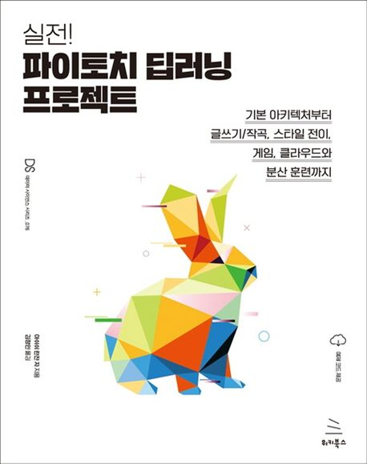

  
<h1 align="center">
  
실전! 파이토치 딥러닝 프로젝트

  
</h1>
  

<b>아쉬쉬 란잔 저 · 김정인 역</b> 
위키북스 · 2022년 02월 16일 출시 
[[github](https://github.com/wikibook/mpytc)] | [[images](https://github.com/wikibook/mpytc/blob/main/9781789614381_ColorImages.pdf)]</b> 

## :bulb: 목표

- **PyTorch로 AI 모델을 구현한다.**

  > PyTorch를 이용해 텍스트 생성 모델, 작곡 모델, DQN 모델 등 다양한 모델을 구현해 본다.

- **모델과 관련된 다양한 기술 익히기**

  > 모델을 운영 환경에 배포하기, 대규모 모델을 분산 방식으로 훈련시키기, AutoML을 이용해 신경망 아키텍처를 효과적으로 검색하기, fast ai로 모델을 빠르게 프로토타이핑하기 등.

 

## 🚩 진행한 프로젝트

### 🚪 PyTorch 튜토리얼

- **PyTorch 모듈과 기초 예제**

  > [PyTorch 모듈](https://github.com/erectbranch/PyTorch_Basic/blob/master/ch01/tutorial.ipynb): torch.nn, torch.optim, torch.utils.data, torch.tensor

  > [CNN 구현하기(MNIST 적용)](hhttps://github.com/erectbranch/PyTorch_Basic/blob/master/ch01/MNIST.ipynb)

 

## :mag: 목차

### [01부] 파이토치 개요

▣ 01장: 파이토치를 이용한 딥러닝 소개

    딥러닝 되짚어보기
    ___활성화 함수
    ___최적화 스케줄
    파이토치 살펴보기
    ___파이토치 모듈
    ___텐서 모듈
    파이토치로 신경망 훈련하기
    요약

▣ 02장: CNN과 LSTM 결합하기

    CNN과 LSTM으로 신경망 만들기
    ___텍스트 인코딩 데모
    파이토치로 이미지 캡션 생성하기
    ___이미지 캡션 데이터셋 다운로드
    ___캡션(텍스트) 데이터 전처리
    ___이미지 데이터 전처리
    ___이미지 캡션 데이터 로더 정의하기
    ___CNN-LSTM 모델 정의하기
    ___CNN-LSTM 모델 훈련하기
    ___훈련된 모델로 이미지 캡션 생성하기
    요약

### [02부] 고급 신경망 아키텍처

▣ 03장: 심층 CNN 아키텍처

    왜 CNN이 막강한가?
    CNN 아키텍처의 발전
    LeNet을 처음부터 구현하기
    ___파이토치로 LeNet 구성하기
    ___LeNet 훈련하기
    ___LeNet 테스트하기
    AlexNet 모델 미세 조정하기
    ___파이토치로 AlexNet 미세 조정하기
    사전 훈련된 VGG 모델 실행하기
    GoogLeNet과 Inception v3 살펴보기
    ___Inception 모듈
    ___1×1 합성곱
    ___전역 평균 풀링
    ___보조 분류기
    ___Inception v3
    ResNet과 DenseNet 아키텍처
    ___DenseNet
    EfficientNet과 CNN 아키텍처의 미래
    요약

▣ 04장: 심층 순환 신경망 아키텍처

    순환 신경망의 발전
    순환 신경망 유형
    ___RNN
    ___양방향 RNN
    ___LSTM
    ___확장된 LSTM과 양방향 LSTM
    ___다차원 RNN
    적층 LSTM
    ___GRU
    ___그리드 LSTM
    ___게이트 직교 순환 유닛
    감성 분석을 위해 RNN 훈련하기
    ___텍스트 데이터셋 로딩 및 전처리
    ___모델 인스턴스화 및 훈련
    양방향 LSTM 만들기
    ___텍스트 데이터셋 로딩과 전처리
    ___LSTM 모델 인스턴스화 및 훈련
    GRU와 어텐션 기반 모델
    ___GRU와 파이토치
    ___어텐션 기반 모델
    요약

▣ 05장: 하이브리드 고급 모델

    언어 모델링을 위한 트랜스포머 모델 만들기
    언어 모델링
    ___트랜스포머 모델 아키텍처
    RandWireNN 모델 구현
    ___RandWireNN 모델의 이해
    ___파이토치로 RandWireNN 개발
    요약

### [03부] 생성 모델과 심층 강화학습

▣ 06장: 파이토치를 활용한 음악, 텍스트 생성

    파이토치로 트랜스포머 기반 텍스트 생성기 만들기
    ___트랜스포머 기반 언어 모델 훈련
    ___언어 모델 저장 및 로딩
    ___언어 모델로 텍스트 생성하기
    텍스트 생성기로 사전 훈련된 GPT-2 사용하기
    ___GPT-2로 바로 사용할 수 있는 텍스트 생성기 구현하기
    ___파이토치를 사용한 텍스트 생성 전략
    파이토치에서 LSTM으로 미디 음악 생성하기
    ___미디 음악 데이터 로딩
    ___LSTM 모델 정의 및 훈련 방법
    ___음악 생성 모델 훈련 및 테스트
    요약

▣ 07장: 신경망 스타일 전이

    이미지 간 스타일 전이하는 방법
    파이토치에서 신경망을 이용한 스타일 전이 구현하기
    ___콘텐츠와 스타일 이미지 로딩
    ___사전 훈련된 VGG19 모델 로딩 및 조정
    ___신경망 스타일 전이 모델 구축
    ___스타일 전이 모델 훈련
    ___스타일 전이 모델 실험
    요약

▣ 08장: 심층 합성곱 GAN

    생성 네트워크와 판별 네트워크 정의
    ___DCGAN 생성 모델과 판별 모델
    파이토치로 DCGAN 훈련하기
    ___생성 모델 정의
    ___이미지 데이터셋 로딩
    ___DCGAN 훈련 루프
    GAN을 이용한 스타일 전이
    ___pix2pix 아키텍처
    요약

▣ 09장: 심층 강화학습

    강화학습 개념
    ___강화학습 알고리즘 유형
    Q-러닝
    심층 Q-러닝
    ___두 개의 분리된 DNN 사용
    ___경험 재현 버퍼
    파이토치에서 DQN 모델 만들기
    ___메인 CNN 모델과 타깃 CNN 모델 초기화
    ___경험 재현 버퍼 정의
    ___환경 설정
    ___CNN 최적화 함수 정의
    ___에피소드 관리 및 실행
    ___퐁 게임을 위한 DQN 모델 훈련
    요약

### [04부] 운영 시스템에서의 파이토치

▣ 10장: 파이토치 모델을 운영 환경에 이관하기

    파이토치에서 모델 서빙
    ___파이토치 모델 추론 파이프라인 생성
    ___기본적인 모델 서버 구축
    ___모델 마이크로서비스 생성
    토치서브를 활용한 파이토치 모델 서빙
    ___토치서브 서버 실행 및 사용
    토치스크립트와 ONNX를 활용해 범용 파이토치 모델 내보내기
    ___토치스크립트의 유틸리티
    ___토치스크립트로 모델 추적하기
    ___토치스크립트로 모델 스크립팅
    ___C++에서 파이토치 모델 실행하기
    ___ONNX를 이용해 파이토치 모델 내보내기
    클라우드에서 파이토치 모델 서빙
    ___AWS에서 파이토치 사용하기
    ___구글 클라우드에서 파이토치 모델 서빙
    ___애저에서 파이토치 모델 서빙
    요약
    참고 문헌

▣ 11장: 분산 훈련

    파이토치를 이용한 분산 훈련
    ___일반 방식의 MNIST 모델 훈련
    ___분산 방식의 MNIST 모델 훈련
    CUDA로 GPU상에서 분산 훈련
    요약

▣ 12장: 파이토치와 AutoML

    AutoML로 최적의 신경망 아키텍처 찾기
    ___Auto-PyTorch로 최적의 MNIST 모델 찾기
    Optuna로 초매개변수 찾기
    ___모델 아키텍처 정의 및 데이터셋 로딩
    ___모델 훈련 방식과 최적화 스케줄 정의
    ___Optuna의 초매개변수 탐색 실행
    요약

▣ 13장: 파이토치와 설명 가능한 AI

    파이토치에서 모델 해석 가능성
    ___필기체 숫자 분류 모델 훈련 - 복습
    ___모델의 합성곱 필터 시각화
    ___모델의 특징 맵 시각화
    Captum을 이용한 모델 해석
    ___Captum 설정
    ___Captum의 해석 도구
    요약

▣ 14장: 파이토치로 빠르게 프로토타이핑하기

    fast.ai를 이용해 몇 분 안에 모델 훈련 설정하기
    ___fast.ai를 설정하고 데이터 로딩하기
    ___fast.ai를 이용한 MNIST 모델 훈련
    ___fast.ai를 이용한 모델 평가 및 해석
    파이토치 라이트닝을 이용한 모델 훈련
    ___파이토치 라이트닝에서 모델 구성 요소 정의
    ___파이토치 라이트닝을 이용한 모델 훈련 및 평가
    요약